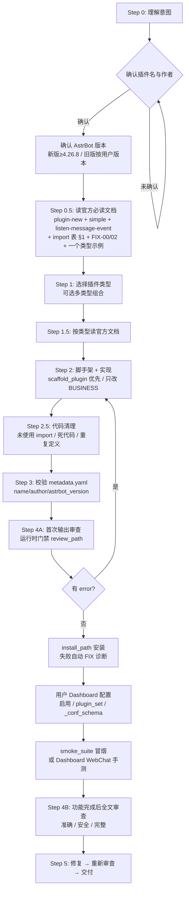

# skill_astrbot_plugin_dev_review

> 为你的 AstrBot 创造更多可能。

```
⚠️ 本 Skill 为了做到更好的开发适配性，而采用了更多的权限（如： 通过 MCP 连接至 Astrbot openAPI ）。
如果担心造成不可逆的破坏性修改，请尽量不要给 LLM 使用 MCP 的完整权限或不使用 MCP。
```

> 如果你有更好的建议和开发过程中遇到的问题，欢迎你将**隐私数据**脱敏后提交 `Issues` 或 `Pull Request` ，这样可以为这个 Skill 提供莫大的帮助，我也会尽全力的去优化。

## 简介

本 Skill 是面向 LLM 和 Vibe Coding 工具的 AstrBot 插件开发参考。覆盖从架构理解、代码生成、自动审核到问题修复的完整闭环，核心目标是**减少 LLM 生成插件时的低级错误**。如果遇到多次才能解决的问题，推荐让 Skill 再次读取官方文档内容。

实际开发中，LLM 最常犯的错误是 import 路径不正确：

```python
# ❌ astrbot.api.logger 模块不存在
from astrbot.api.logger import logger
# ✅ 正确写法
from astrbot.api import logger
```

本 Skill 内置 **31 条 import 校验表** 和 **30 个自动修复模式（FIX-00 ~ FIX-29）**，让 AI 生成代码时尽量杜绝以下常见问题：

- **废弃 API 误用**：`on_keyword`/`on_full_match`/`on_regex` 在 v4.x 已移除，需改用 `event_message_type` + Python 匹配
- **适配器配置冲突**：官方 `register_platform_adapter` 会自动注入 `id`/`enable`，`default_config_tmpl` 里不要重复声明，也不要放 `_conf_schema.json`
- **dataclass 可变默认值**：`parameters: dict = {...}` 必须改为 `field(default_factory=lambda: {...})`
- **配置注入缺失**：`__init__` 必须声明 `config: AstrBotConfig` 参数
- **依赖声明遗漏**：requirements.txt 交叉检查规则
- **main.py 膨胀**：模块拆分指南（`references/modular-split.md`）
- **命令参数绑定**：`event.message_str` 取代函数参数，避免 `got multiple values` 错误
- **ToolExecResult 兼容性**：Python 3.12 下直接返回 `str` 即可
- **未使用 import / 死代码**：LLM 常生成不需要的 import 和未使用的变量
- **StarTools 调用限制**：`get_data_dir()` 必须在 `Star` 子类中调用
- **命名空间冲突**：`services/`、`handlers/` 等通用包名在多插件环境下会冲突
- **插件与工具开关分离**（≥4.26.x）：插件启用 ≠ 每个 LLM Tool 启用
- **卸载清 KV**（≥4.26.2）：卸载后插件 KV 会被清理
- **插件市场 / 发布**（≥4.26.8）：[AstrBot Cloud](https://cloud.astrbot.app) 为新市场；发布 ZIP **≤16MB**
- **配置 dict 默认值**（≥4.26.8）：核心为字典配置字段补默认值映射
- **按插件日志级别**（≥4.26.8）：Dashboard / `PUT .../plugins/{id}/log-level`

---

> ## ⚠️ 开始之前：确认你的 AstrBot 版本
>
> 本 Skill 的规则与示例以 **≥4.26.8** 为目标（也兼容 ≥4.16 的地板）。**动手生成插件前**：
>
> 1. **先向用户确认**其 AstrBot 实际版本（`Dashboard 设置 → 关于` 或 `astrbot --version`）。
> 2. **新版（≥4.26.8）**：按 Skill 当前规则与示例写即可。
> 3. **旧版**：以用户当前版本为准——`metadata.yaml` 的 `astrbot_version` 写成兼容范围（如 `">=4.16"`），**不要**使用旧版不支持的 API（如 dict 配置默认值、按插件日志级别、Cloud 市场发布等）。
> 4. 版本不确定时，先问，不要默认假设新版。

---

## MCP 服务器（推荐开启）

内置 MCP 服务器把 Skill 从「文档 + 规则」升级为**可运行的开发助手**：

- **文档 / 审核工具（6）**：`get_skill_info` / `list_docs` / `get_doc` / `search_docs` / `validate_import` / `get_review_checklist` —— 无需 AstrBot，始终可用
- **AstrBot Runtime 工具（24）**：P0 读取 → P1 管理（含 per-plugin log-level）→ P2 安装/卸载 → P2+ 脚手架与静态审查 → P2.5 开发档案 → P3 WebChat smoke → P3+ smoke 复合套件

**推荐开发闭环**：

```
astrbot_scaffold_plugin（契约脚手架，error=0 不变量）
  → astrbot_review_path（静态审查，修完 error）
  → astrbot_plugin_install_path（失败自动附 FIX 诊断）
  → 用户在 Dashboard 配置（启用 / plugin_set / _conf_schema）
  → astrbot_smoke_suite（自动生成用例冒烟）
```

权威安装与工具说明见 `mcp/SETUP.md`；`README` 仅给 Kilo / `kilo.jsonc` 速查模板。

### 快速配置

```bash
cd mcp && python3 -m venv .venv && .venv/bin/pip install -r requirements.txt
```

```jsonc
{
  "mcp": {
    "skill-astrbot-plugin": {
      "type": "local",
      // 双绝对路径：venv 的 python3 + mcp/server.py（Kilo 不会把相对 server.py 接到 cwd）
      "command": [
        "/实际路径/skill_astrbot_plugin_dev_review/mcp/.venv/bin/python3",
        "/实际路径/skill_astrbot_plugin_dev_review/mcp/server.py"
      ],
      "cwd": "/实际路径/skill_astrbot_plugin_dev_review/mcp",
      "enabled": true,
      "env": {
        // 局域网 AstrBot 根地址（跨设备请写主机 IP:端口，不要写对方机器的 localhost）
        "ASTRBOT_BASE_URL": "http://192.168.x.x:6185",

        // Dashboard API Key（默认请求头 X-API-Key；勿提交仓库）
        // 推荐权限（≥4.27.0）：plugin + config + provider + chat
        // 说明：config 不再默认勾选；插件 config 端点属于 plugin scope（非 config）；
        // 仅 admin 操作需 config:edit_admin / chat:admin 子权限（本 MCP 默认不需要）
        "ASTRBOT_TOKEN": "your-api-key",

        // 鉴权方式：api_key（默认）| bearer | auto
        "ASTRBOT_AUTH_MODE": "api_key",

        // HTTP 超时秒数（默认 15；慢盘/VPN/上传 ZIP 可调高）
        "ASTRBOT_HTTP_TIMEOUT": "20",

        // 允许写操作：reload / 启停 / 改配置 / 本地安装 / 卸载 / 创建 plugin_dev_skill（默认 false）
        "ASTRBOT_ALLOW_MUTATIONS": "true",

        // 允许不经 confirm_probe 调 chat_probe（默认 false；仍建议对话内用户明确同意后再测）
        "ASTRBOT_ALLOW_CHAT_PROBE": "false",

        // WebChat 发送者用户名（chat_probe 必填；可与 Dashboard 登录名一致）
        "ASTRBOT_CHAT_USERNAME": "your_webchat_user",

        // chat_probe 默认配置档案名（默认 plugin_dev_skill；勿依赖 default 测插件）
        "ASTRBOT_CHAT_CONFIG_NAME": "plugin_dev_skill",

        // 可选：smoke 固定会话 id（默认 mcp-smoke-<username>，所有 probe 复用同一条，
        // 列表恒定一条、Dashboard 可管理；一般无需修改）
        // "ASTRBOT_CHAT_SMOKE_SESSION_ID": "mcp-smoke-your_webchat_user",

        // 可选：错误指纹库路径（gitignored）。install/smoke 失败自动记录「脱敏」错误，
        // 供 error_kb.py 反哺 auto-fix-guide.md。示例：".error_kb.json"（相对 mcp/）
        // "ASTRBOT_ERROR_KB": "/实际路径/skill_astrbot_plugin_dev_review/mcp/.error_kb.json"
      }
    }
  }
}
```

> **路径必须以可用配置为准**：`python3` 与 `server.py` 均用**绝对路径**。部分客户端（如 Kilo）启动 MCP 时以工作区根目录解析相对脚本路径，**不会**把相对 `server.py` 接到 `cwd` 下，会导致 `MCP error -32000: Connection closed`。
>
> **装进 AstrBot 后的推荐用法**：本 Skill 作为插件上传后位于 `/AstrBot/data/skills/skill_astrbot_plugin_dev_review/`。用 **AstrBot 自带 MCP 客户端**（设置 → MCP）注册本服务器的 stdio 命令即可，`ASTRBOT_BASE_URL` 填 `http://127.0.0.1:6185`（同实例，无需走网络）。模板与安全说明见 `mcp/SETUP.md` §4b。

### 注：在 AstrBot 中使用

> 本节只讲 **MCP 在 AstrBot 内的用法**（AstrBot 自带 MCP 客户端，v3.5.0+）。适用「Skill 已作为插件上传进 AstrBot」的场景；本机 IDE/Kilo 用法见上方「快速配置」。

**1) 上传 Skill**
把本仓库（或 GitHub zip）作为 Skill 上传到 AstrBot，安装后位于：

```text
/AstrBot/data/skills/skill_astrbot_plugin_dev_review/
├── SKILL.md
└── mcp/
    ├── run.py      ← 自举启动器（无需手动建 venv）
    ├── server.py
    └── ...
```

**2) 添加 MCP 服务器（AstrBot 设置 → MCP）**

```json
{
  "command": "python3",
  "args": [
    "/AstrBot/data/skills/skill_astrbot_plugin_dev_review/mcp/run.py"
  ],
  "env": {
    "ASTRBOT_BASE_URL": "http://127.0.0.1:6185",
    "ASTRBOT_TOKEN": "your-dashboard-api-key",
    "ASTRBOT_ALLOW_MUTATIONS": "false",
    "ASTRBOT_ALLOW_CHAT_PROBE": "false",
    "ASTRBOT_CHAT_USERNAME": "your_webchat_user",
    "ASTRBOT_CHAT_CONFIG_NAME": "plugin_dev_skill"
  }
}
```

- `command` 必须是白名单内的 `python3`（AstrBot 禁止 `bash/sh` 与 `-c` 内联）。
- `args` 指向 **`mcp/run.py`**（不是 server.py）：首次被拉起时自动建 `.venv` + 装依赖，之后直跑 `server.py`；若容器系统 Python 已自带 `mcp` 依赖，则**连 venv 都省了**。
- `ASTRBOT_BASE_URL` 填 `127.0.0.1:6185`（同实例自调，不走网络）。

**API Key 权限（≥4.27.0，Dashboard → 设置 → API Key → scopes）**
- **推荐勾选：`plugin` + `config` + `provider` + `chat`**
- `plugin`：插件管理 + 插件 config 读写（`/plugins/{id}/config*` 属 plugin scope，不是 `config`）
- `config`：配置档案（`config_profiles_brief` / `ensure_plugin_dev_skill`）
- `provider`：Provider 列表
- `chat`：WebChat 会话/探测/smoke
- 不需要：`bot`/`im`/`data`/`file`/`mcp`/`persona`/`skill`
- 注意：**`config` 不再默认勾选**；仅改 admin 配置需 `config:edit_admin`、仅以管理员身份跑 admin 指令需 `chat:admin`（本 MCP 默认不需要）

**3) 测试连接**
- 首次「测试连接」约 30–60s（建 venv / 装依赖），之后秒过。
- 连接成功后，AstrBot 的 LLM 可直接调用本 Skill 的 **6 个文档工具 + 24 个 runtime 工具**。

**4) 失败排查（快速）**
| 现象 | 处理 |
|------|------|
| `No such file or directory: '.../.venv/bin/python3'` | 用 `run.py` 入口（会自动创建），或 `docker exec astrbot rm -rf .../mcp/.venv` 后重试 |
| `No module named 'mcp.server.fastmcp'` | 走 `run.py`（自举）而非直接 `server.py`；或确认容器网络可访问 PyPI |
| `Permission denied: '.../.venv/bin/python3'` | `.venv` 为异机创建，删除后在**容器内**重建（root 下直接 `python3 -m venv`） |
| 连接成功但 `astrbot_*` 工具 `not_configured` | 检查 `ASTRBOT_TOKEN` / `ASTRBOT_BASE_URL` 是否已填 |

**5) 安全**
- 远程/共享环境保持 `ASTRBOT_ALLOW_MUTATIONS=false`（只读）；确需写操作仅在可信实例开启。
- `ASTRBOT_TOKEN` 只存在 AstrBot WebUI 配置里，**不要**提交进仓库。
- 详细模板与说明见 `mcp/SETUP.md` §4b。

### Runtime 环境变量一览

| 环境变量 | 默认 | 作用 |
|----------|------|------|
| `ASTRBOT_BASE_URL` | 空 | 启用 Runtime；空则仅文档工具可用 |
| `ASTRBOT_TOKEN` | 空 | API 鉴权（不回显到工具输出） |
| `ASTRBOT_AUTH_MODE` | `api_key` | `api_key` / `bearer` / `auto` |
| `ASTRBOT_HTTP_TIMEOUT` | `15` | 请求超时（秒）；上传/对话可能更高 |
| `ASTRBOT_ALLOW_MUTATIONS` | `false` | 插件写操作与建开发档案总开关 |
| `ASTRBOT_ALLOW_CHAT_PROBE` | `false` | 放宽 chat_probe 门禁（仍推荐 `confirm_probe=true`） |
| `ASTRBOT_CHAT_USERNAME` | 空 | chat_probe 默认 username |
| `ASTRBOT_CHAT_CONFIG_NAME` | `plugin_dev_skill` | chat_probe 默认配置档案名 |
| `ASTRBOT_CHAT_SMOKE_SESSION_ID` | `mcp-smoke-<username>` | smoke 固定会话 id（所有 probe 复用同一条，Dashboard 可管理） |
| `ASTRBOT_ERROR_KB` | 空 | 错误指纹库路径（gitignored）；install/smoke 失败自动记录脱敏指纹，反哺 auto-fix-guide |
| `ASTRBOT_DEV_WORKSPACE` | `~/.astrbot_skill_workspace` | scaffold 暂存目录（绝不用 cwd，避免容器内落到 /AstrBot/<name>/） |

### 功能一览（工具）

| 阶段 | 功能 | 代表工具 | 依赖 |
|------|------|----------|------|
| Docs | 文档检索、import 校验、审核清单 | `get_doc` / `validate_import` / … | 无需 AstrBot |
| P0 | 连通探测、插件列表/失败/详情 | `astrbot_runtime_info` / `list` / `failed` / `get` | BASE_URL + Token |
| P1 | 读改配置、启停、重载 | `config_get/set` / `set_enabled` / `reload` | + MUTATIONS（写） |
| P1+ | 按插件日志级别（v4.27.0） | `log_level_get`（只读）/ `log_level_set`（mutations） | plugin scope；`config` 不涉 |
| P2 | 本地 ZIP 安装、安全卸载 | `install_path` / `pack_preview` / `uninstall` | + MUTATIONS；卸载默认保留配置/数据 |
| P2+ | **契约脚手架**：8 类型 + adapter 框架，error=0 不变量 | `scaffold_plugin` | 纯本地，无需 AstrBot |
| P2+ | **AST 静态审查器**：FIX 规则代码化，发现项直链 auto-fix-guide | `review_path`（profile=plugin\|adapter） | 纯本地，无需 AstrBot |
| P2.5 | 开发档案 `plugin_dev_skill`、装后 Dashboard 提示 | `ensure_plugin_dev_skill` / `providers_brief` / `post_install_hints` | 建档需 MUTATIONS；**不私自读配置全文** |
| P3 | WebChat 会话列表、可选 smoke、webchat 会话清理 | `chat_sessions_brief` / `chat_probe` / `chat_sessions_cleanup` | Token 含 **chat**；probe 需用户允许；固定会话 `mcp-smoke-<username>` |
| P3+ | **smoke 复合套件**：状态 → 按组件生成用例 → 逐条 probe → 崩溃复查 → 聚合判定 | `smoke_suite` | 同 chat_probe 门禁；admin 指令默认跳过 |

### WebChat 会话策略（P3 设计说明）

经源码级验证（AstrBot `chat_service.py`）：删除会话时校验 `session.creator == 认证身份`，而 API Key 的身份是 `api_key:<key_id>`——**API Key 永远无法删除 Dashboard 用户创建的会话**。因此本 MCP 采用固定会话方案：

- 所有 smoke 测试复用**同一条**会话 `mcp-smoke-<username>`，列表恒定一条、不再累积
- 该会话归属用户本人，Dashboard WebChat 中可随时查看/删除（删除后下次 probe 自动重建）
- `chat_sessions_cleanup` 仅能删 webchat 平台会话（其他平台一律拒绝，隐私硬边界），且仅对 API Key 自建会话有效
- **不要**为绕过此限制给 API Key 加 system 权限——权限最小化优先
- **`chat_probe` 的 message 用插件自己的命令**：不确定时先发 `/plugin_help` 探测，再按其真实指令测试；**不要**硬编码其它插件的命令（如 `/ttsinfo` 仅 mimo_tts 使用）

---

## 核心工作流



> 官方文档（`star/plugin-new.md` + `star/guides/*`）是权威来源；**不要**把旧 `plugin.md` 当权威。Skill 为补充；冲突时以官方为准。
> **高风险操作**（git commit / push / force、大规模改写已可运行代码）必须用户明确允许后再执行。

### 意图判断

LLM 应先判断用户需要什么，再决定读哪些文件：

| 用户说 | 意图 | 行动 |
|--------|------|------|
| "写一个插件" | 新插件 | 完整流程 |
| "加一个指令" | 追加功能 | 读现有代码，加 handler |
| "让 AI 调用我的 API" | 加 LLM 工具 | 只读 `agent/tools.md` |
| "帮我审核一下" | 全量审核 | 跑完整审核流水线 |
| "修一下这个报错" | 定位修复 | 读错误信息，定点修复 |

### 插件类型可组合

插件类型不是互斥的，一个插件可以同时包含多种类型：

```
指令 + LLM 工具:   /weather 指令 + AI 自动调用天气 API
指令 + 定时任务:   /remind 指令 + 定时提醒
LLM 工具 + 钩子:   AI 调用工具 + 钩子注入上下文
指令 + Web API:    /status 指令 + Dashboard 页面
```

完整类型选择指南见 `plugin-types/README.md`。

---

## 开发规范

以下是开发过程中必须遵守的规则，详细说明见 `SKILL.md` Mandatory Rules：

| 规则 | 说明 |
|------|------|
| 身份门禁 | 脚手架前必须确认插件名 `astrbot_plugin_*` 与作者，未确认不得创建目录 |
| **版本确认** | 生成前先确认用户 AstrBot 版本（新版 ≥4.26.8 / 旧版按其版本写 `astrbot_version`），避免用不支持的新 API |
| 官方文档优先 | 以 `star/plugin-new.md` + `star/guides/*` 为准；**禁止**旧 `plugin.md` 当权威 |
| 两阶段审查 | 首次输出：Phase A 运行时全文校对；功能完成/用户审核：Phase B 全文准确·安全·完整 |
| 高风险操作 | git commit/push/force、大规模改写已运行代码、批量删除 — 须用户明确允许 |
| 卸载插件数据安全 | 卸载前须询问是否保留配置与持久化数据；**未回答则默认保留**；禁止擅自删除配置/数据 |
| 本地安装/更新 | 方案 A：ZIP → `install/upload` → enable → reload → failed；**优先重传**；`success≠源码已替换`（同 version 可能陈旧）→ 抬 version 或 `force_refresh=true`（卸载**保留**配置/数据后重装） |
| 开发测试配置 | 专用档案 `plugin_dev_skill`（基于 default，用户自选 Provider，只开当前插件）；Dashboard WebChat 主测；MCP 自动对话默认关闭 |
| 配置隐私 | 禁止擅自读取插件/AstrBot 配置；装后仅提示前往 Dashboard；用户点名参数才可查；`config_get(redact=false)` 仅编辑时用 |
| 插件与工具开关分离 | ≥4.26.x 插件启用 ≠ 每个 LLM Tool 启用 |
| 卸载与 KV | ≥4.26.2 卸载会清理插件 KV |
| 插件发布 | Cloud 市场 + ZIP ≤16MB；metadata 完整；打包排除与 MCP `zip_pack` 一致 |
| 配置 schema dict | ≥4.26.8 核心映射 dict 默认值；仍避免可变默认共享陷阱 |
| 插件日志级别 | ≥4.26.8 可按插件设置 DEBUG/INFO/… 或跟随全局 |
| docstring | 所有 `@filter.command` 必须有 docstring |
| 参数绑定 | 用 `event.message_str.strip()` 获取用户输入，不要用函数参数 |
| command_group | 必须用函数模式 `def math(): pass`，不能用 class |
| Tool 返回值 | `Tool.call()` 必须返回 `str`，不要用 `ToolExecResult` |
| dataclass 字段 | dict/list 字段必须用 `field(default_factory=...)`，不能直接写字面量 |
| 废弃 API | `on_keyword`/`on_full_match`/`on_regex` 已移除，用 `event_message_type` 替代 |
| 配置读取 | `__init__` 需接收 `config: AstrBotConfig` 并赋值 `self.config = config` |
| 首次生成 | metadata/conf_schema/README 跟随用户语言；`repo` 留空 |
| 代码清理 | 审核前移除未使用 import、死代码、重复定义 |
| 网络库 | 必须用 `aiohttp`/`httpx`（异步），不能用 `requests` |
| 数据存储 | 持久化数据存 `data/` 目录（`StarTools.get_data_dir()`），不存插件目录 |
| StarTools | `get_data_dir()` 必须在 `Star` 子类中调用，不能在 Service 类中直接调用 |
| 命名空间 | 使用 `services/` 等通用包名时，main.py 顶部加 `sys.path.insert(0, os.path.dirname(__file__))` |
| 插件命名 | `astrbot_plugin_` 前缀，小写，无空格 |
| 适配器配置 | 只用 `register_platform_adapter` 的 `default_config_tmpl` + `config_metadata`；**禁** `_conf_schema.json`；tmpl 勿重复 `id`/`enable` |
| 审核流程 | 用户要求审核时，必须全量检查所有文件 |
| 敏感操作 | git push 等必须经用户确认 |
| 上下文连续性 | 多轮交互中确保不丢失已修改文件和未解决问题 |

---

## 审核体系

本 Skill 的审核规则灵感来源于以下项目，在此对 AstrBot Community 团队表示由衷的感谢：

- [AstrBot-Skill v4](https://github.com/xunxiing/AstrBot-Skill/tree/v4) — AstrBot 的 AGENT SKILL 仓库，包含插件开发的结构化技术文档和 Skill 定义。
- [astr-plugin-reviewer](https://github.com/AstrBotDevs/astr-plugin-reviewer) — GitHub App 自动审核机器人
- 个人开发的插件实践：`astrbot_plugin_synochat_adapter`（适配器配置冲突）、`astrbot_plugin_mimo_tts`（模块化拆分）

审核覆盖 5 个维度：代码质量、功能正确性、安全性、可维护性、潜在缺陷。自动化部分由 MCP `review_path`（AST 静态审查，FIX/META/REQ 规则直链）承担，人工判断由 Phase A/B 工作流承担。

## ⚠️ 免责声明

本 Skill 的预审机制**仅用于减少被基础审查驳回的概率**，不能替代完整的代码审查和测试：

- **不要完全依赖预审** — 规则覆盖了常见问题，但无法覆盖所有边界情况
- **自行评估架构影响** — 插件是否影响其他插件或系统，需要开发者判断
- **做好功能测试** — 预审通过不代表功能正确，务必实际测试
- **保持上下文连续性** — 多轮交互中确保不丢失修改状态，必要时先总结再继续

## 官方文档引用规则

代码生成、修复、审核的**每个阶段**都必须参考官方文档，而不是仅在"不确定时"才查阅：

| 阶段 | 必须查阅的官方文档 |
|------|-------------------|
| 代码生成前 | [AstrBot 开发文档](https://docs.astrbot.app/dev/) 中与所选类型对应的指南 |
| 修复 bug 时 | 对应 API 所在的官方文档章节，确认签名和用法 |
| 审核代码时 | 对照官方文档校验所有 API 调用是否正确 |

官方文档是 AstrBot API 的唯一权威来源。本 Skill 中的内容是对官方文档的整合和补充，当两者冲突时以官方文档为准。

---

## 维护（开发者）

### 单元测试

```bash
cd mcp && .venv/bin/pytest tests/
```

**180 个用例**，无需 AstrBot 实例（conftest 自动清空 `ASTRBOT_*` env，永不误触真实服务）。覆盖：ZIP 打包排除/命名规则（以 `plugin-types/type2-session-waiter` 真实示例插件为 fixture）、env 安全开关解析、SSE 解析与固定会话策略（httpx MockTransport）、鉴权头与"HTTP 200 错误信封"识别、失败分类签名、静态审查规则（示例插件须零 error）、smoke 用例生成与判定、scaffold 全类型 error=0 不变量、错误指纹脱敏与 FIX 提案校验、import 表单源。

### OpenAPI 契约漂移检测

```bash
python3 mcp/scripts/check_openapi_drift.py            # 常规检测
python3 mcp/scripts/check_openapi_drift.py --update   # 刷新本地快照
python3 mcp/scripts/check_openapi_drift.py --offline  # 离线校验 runtime ↔ 快照
```

数据源为官方 [`docs.astrbot.app/openapi.json`](https://docs.astrbot.app/scalar.html)（ETag 增量检测，未变化时 304 秒回）。脚本自动扫描 `mcp/runtime/` 中实际使用的 18 条端点，退出码：`0` 无漂移 / `1` **runtime 所用端点受影响**（先修 runtime 再信任工具）/ `2` 漂移但不涉及 runtime。**每次 AstrBot 发新版后建议跑一次**。

### 错误指纹回测 → 反哺 auto-fix-guide

安装/冒烟遇到的报错可被**脱敏**成稳定指纹（路径/UUID/token/插件名/行号全部打码），重复出现且未被既有规则识别的指纹，可自动生成 `auto-fix-guide.md` 的 FIX 草稿。

```bash
# 1) 开启自动记录（可选；install/smoke 失败会自动写入）
export ASTRBOT_ERROR_KB="$PWD/mcp/.error_kb.json"

# 2) 回测：对 plugin-types/type* 与 adapter 跑 install_path / smoke_suite

# 3) 查看收集到的脱敏指纹（样本、次数、来源插件）
python3 mcp/scripts/error_kb.py --store mcp/.error_kb.json report

# 4) 生成新 FIX 草稿（内置自动校验：重复/过泛/纯占位符会被跳过）
python3 mcp/scripts/error_kb.py --store mcp/.error_kb.json propose \
    --guide review/auto-fix-guide.md --min 2
```

**自动校验（写入前）：** `propose` 只输出通过校验的草稿（exit 0）；未通过的（`placeholder_only` / `too_generic` / 与 guide 重复的 pattern 或标题 / 非法正则）列出为 **skipped**（exit 1），**不得**原样写入。通过后的草稿仍需人工核对真实 traceback 的根因，再并入 `review/auto-fix-guide.md`，并把指纹正则合入 `failure_analysis._SIGNATURES` 实现自动分类。

---

## 版本要求

- **AstrBot**：skill 规则兼容 **≥4.16**；开发/联调建议 **≥4.26.8**（Cloud 市场、dict 配置默认值、按插件日志级别、本地上传挂起修复、Cron 持久任务加载等）。**生成插件前先确认用户实际版本。**
- Python：工具链 **≥3.10**；官方文档侧倾向 **3.12**（推荐）
- OpenAPI：浏览 [Scalar](https://docs.astrbot.app/scalar.html)；机器可读 [openapi.json](https://docs.astrbot.app/openapi.json)。本地可用 `mcp/scripts/check_openapi_drift.py` 与快照 diff（**已验证 4.26.8 与当前 145 paths 无路径漂移**；`PUT .../log-level` 已在核心源码但**尚未**进入公开 openapi.json）

---

## 目录结构

```
skill_astrbot_plugin_dev_review/
│
├── SKILL.md                              # 主入口（英文），含 Mandatory Rules + Workflow
├── AGENTS.md                             # Skill 体系标识（AI 自动识别入口）
├── README.md                             # 本文件（中文）
├── LICENSE                               # MIT 授权
├── plugin-development-workflow.md        # 9 步开发流程
│
├── design_standards/                     # 架构与设计
│   ├── architecture_overview.md          # 核心架构（5 大管理器）
│   ├── event_flow.md                     # 消息流转模型（9 步）
│   ├── context_usage.md                  # Context 对象 API
│   ├── sandbox.md                        # 沙盒存储挂载
│   └── visual_utils.md                   # HTML 渲染 / 文转图详细参数
│
├── messages/                             # 消息模型
│   ├── model.md                          # AstrBotMessage 结构
│   ├── components.md                     # 消息组件（Plain/At/Image/Record/Video...）
│   ├── events.md                         # AstrMessageEvent 完整 API
│   └── umo.md                            # 统一消息源格式
│
├── platform_adapters/                    # 平台适配器
│   ├── adapter_interface.md              # 完整接口 + config_metadata 规则 + 真实示例
│   ├── message_conversion.md             # 消息转换逻辑
│   └── telegram_media_group.md           # Telegram 媒体组防抖合并
│
├── agent/                                # Agent 智能体系统
│   ├── index.md                          # 概述 + 最小示例
│   ├── tools.md                          # 工具定义（类/装饰器/内部工具）
│   ├── invoke-llm.md                     # LLM 调用 API
│   ├── hooks.md                          # Plugin Hooks + Agent Runner Hooks
│   ├── conversation.md                   # 会话管理 + 提示词注入
│   ├── cron.md                           # 定时任务（Basic/Active Job）
│   ├── subagents.md                      # 子智能体 Handoff
│   ├── official-tools.md                 # 官方内置工具列表
│   ├── sandbox.md                        # 沙盒运行时 API
│   ├── agent-runner.md                   # Agent Runner (v4.7.0+)
│   ├── context-compression.md            # 上下文压缩参数
│   ├── persona-control.md                # 人格管理 CRUD
│   └── register-skill.md                 # Skill 注册
│
├── storage_utils/                        # 存储与工具
│   ├── kv_storage.md                     # KV 键值对存储
│   ├── file_storage.md                   # 文件存储规范
│   ├── text_to_image.md                  # 文转图 / HTML 渲染
│   └── plugin-i18n.md                    # 插件国际化
│
├── webui/                                # WebUI
│   └── plugin-pages.md                   # Dashboard 页面 + Bridge API + SSE + 安全约束
│
├── references/                           # 参考文档
│   ├── core-concepts.md                  # 核心 API 清单
│   ├── best-practices.md                 # 最佳实践
│   ├── conf-schema.md                    # 配置 Schema 参考
│   ├── plugin-patterns.md                # 10 种实现模式
│   └── modular-split.md                  # main.py 拆分指南
│
├── review/                               # 自动审核体系
│   ├── review-workflow.md                # 审核流程 + 五维审查模型
│   ├── metadata-validation.md            # 结构校验（含 requirements.txt 交叉检查）
│   ├── main-file-checklist.md            # main.py 检查（import 表由 contracts.py 维护）
│   ├── general-file-checklist.md         # 通用代码审查
│   └── auto-fix-guide.md                 # 30 个修复模式（FIX-00 ~ FIX-29）
│
├── plugin-types/                         # 插件类型示例（6 种 + script/ 基础模板）
│   ├── README.md                         # 类型选择指南 + 决策树
│   ├── REVIEW-REPORTS.md                 # 审核报告（本地维护，gitignore，不入库）
│   ├── type1-llm-tool/                   # LLM 工具插件
│   ├── type2-session-waiter/             # 多轮对话插件
│   ├── type3-scheduled-task/             # 定时任务插件
│   ├── type4-llm-hook/                   # LLM 钩子插件
│   ├── type5-web-api/                    # Web API 插件
│   └── type6-agent-subagent/             # Agent 子智能体插件
│
├── script/                               # 插件模板
│   ├── index.md                          # 模板说明
│   └── astrbot-plugin-demo/              # 基础指令插件模板
│
└── mcp/                                  # 内置 MCP 服务器
    ├── server.py                         # MCP 入口（Docs + 可选 Runtime）
    ├── run.py                            # 自举启动器（AstrBot 内 MCP 零配置入口，自动建 venv）
    ├── requirements.txt                  # MCP 依赖（httpx / pathspec / pytest）
    ├── SETUP.md                          # 安装与 Runtime 权威说明
    ├── OPENAPI-SYNC.md                   # OpenAPI 快照与漂移记录
    ├── runtime/                          # AstrBot OpenAPI 控制面（P0–P3+）
    │   ├── config.py                     # env 配置解析（安全门禁地基，密钥不回显）
    │   ├── contracts.py                  # 共享契约（import 表 / FIX 映射 / 类型 / requirements）【单源】
    │   ├── client.py                     # OpenAPI HTTP 客户端（鉴权/错误分类/SSE）
    │   ├── register.py                   # 24 个 Runtime 工具注册（FastMCP）
    │   ├── tools_impl.py                 # P0 读：runtime_info / 插件列表 / failed / 详情
    │   ├── tools_manage.py               # P1 管：配置读写 / 启停 / 重载
    │   ├── tools_lifecycle.py            # P2 卸载（默认保留配置/数据 + 双重确认）
    │   ├── tools_install.py              # P2 安装（打包 → 上传 → enable → reload → failed）
    │   ├── zip_pack.py                   # gitignore 精确打包（硬排除底线不可覆盖）
    │   ├── failure_analysis.py           # 失败分类器（traceback → FIX 规则直链）
    │   ├── error_fingerprint.py          # 脱敏错误指纹 + FIX 提案校验（反哺 auto-fix-guide）
    │   ├── review_static.py              # AST 静态审查器（FIX 规则代码化；plugin/adapter profile）
    │   ├── scaffold_plugin.py            # 契约脚手架（8 类型 + adapter 框架，error=0 不变量）
    │   ├── tools_smoke.py                # smoke 复合套件（用例生成 → probe → 判定）
    │   ├── tools_profile.py              # P2.5 plugin_dev_skill 档案 / Provider 清单
    │   └── tools_chat.py                 # P3 WebChat smoke（固定会话）+ 会话清理
    ├── tests/                            # 单元测试（180 用例，无需 AstrBot 实例）
    │   ├── conftest.py                   # 自动清空 ASTRBOT_* env（永不误触真实实例）
    │   ├── test_zip_pack.py              # 打包排除/命名规则（type2 示例插件作 fixture）
    │   ├── test_config.py                # env 解析与安全开关默认值
    │   ├── test_client.py                # 鉴权头 / 错误分类 / 200 错误信封
    │   ├── test_tools_chat.py            # SSE 解析 / 会话策略 / 门禁（httpx MockTransport）
    │   ├── test_tools_smoke.py           # smoke 用例生成 / 判定 / soft 多轮
    │   ├── test_tools_install.py         # 指纹 / stale 检测 helpers
    │   ├── test_failure_analysis.py      # 失败分类签名 / traceback 挖掘
    │   ├── test_review_static.py         # 静态审查规则（示例插件须零 error）
    │   ├── test_scaffold_plugin.py       # scaffold 全类型 error=0 不变量
    │   ├── test_error_fingerprint.py     # 脱敏 / store / FIX 提案校验
    │   └── test_contracts_import_table.py # import 表单源（docs MCP validate_import）
    └── scripts/
        ├── check_openapi_drift.py        # OpenAPI 契约漂移检测（对比线上 spec）
        └── error_kb.py                   # 错误指纹 record/report/propose
```

完整文件地图见 `SKILL.md`。

---

## 相关链接

- [AstrBot 仓库](https://github.com/AstrBotDevs/AstrBot) · [v4.26.8 发布说明](https://github.com/AstrBotDevs/AstrBot/releases/tag/v4.26.8)
- [AstrBot 开发文档](https://docs.astrbot.app/dev/) · [从这里开始](https://docs.astrbot.app/dev/star/plugin-new.html) · [发布插件](https://docs.astrbot.app/dev/star/plugin-publish.html)
- [AstrBot Cloud 插件市场](https://cloud.astrbot.app) · [发布页](https://cloud.astrbot.app/publish)
- [HTTP API (Scalar)](https://docs.astrbot.app/scalar.html)
- 历史插件列表参考：[AstrBot-Plugins](https://github.com/AstrBotDevs/AstrBot-Plugins)
- [AstrBot-Skill 仓库](https://github.com/xunxiing/AstrBot-Skill/tree/v4)

## 致谢

本项目源于 `AstrBot-Skill` 的启发，整合了本人在使用 AI 开发 AstrBot 插件的过程中出现的问题和解决方案，并且在流程上增加了半自动的代码审核体系，力求减少报错。

> 希望本 Skill 对你的开发有所帮助 ^_^
>
> 如果喜欢希望你能够点一个 🌟 Star

 Made with ❤️ by Unsuited_ 